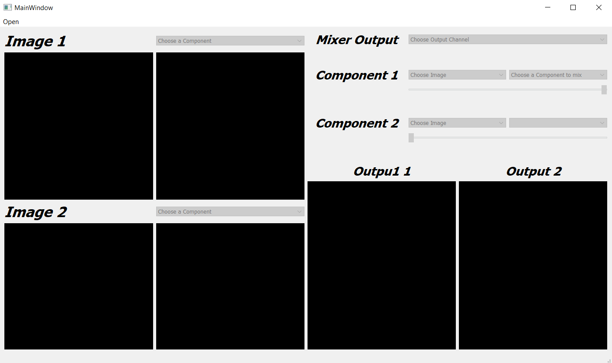
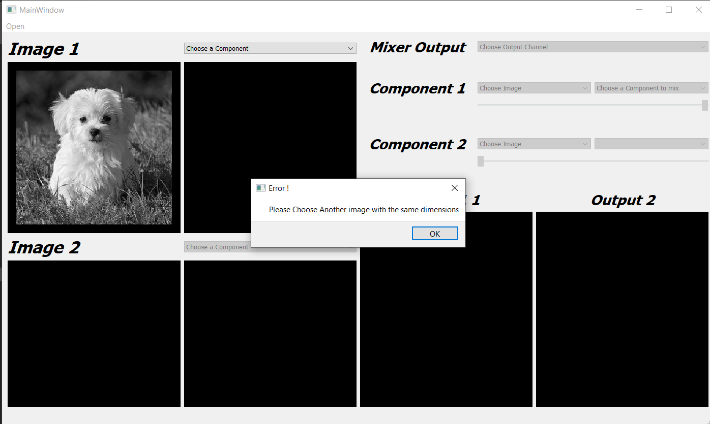
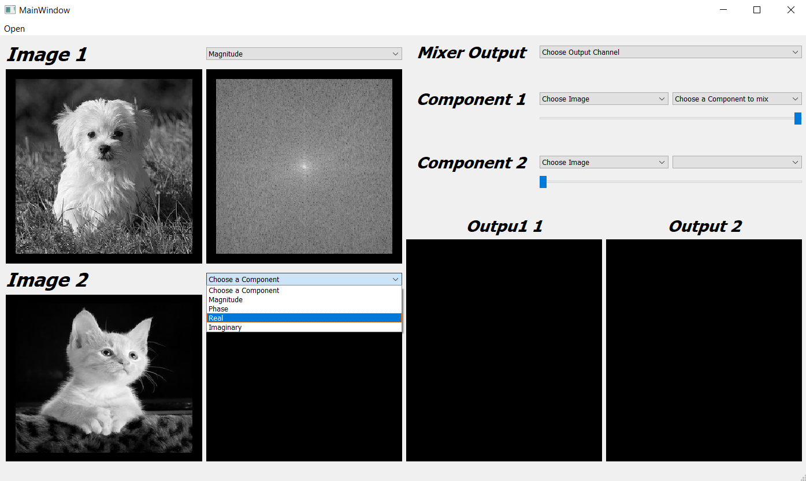
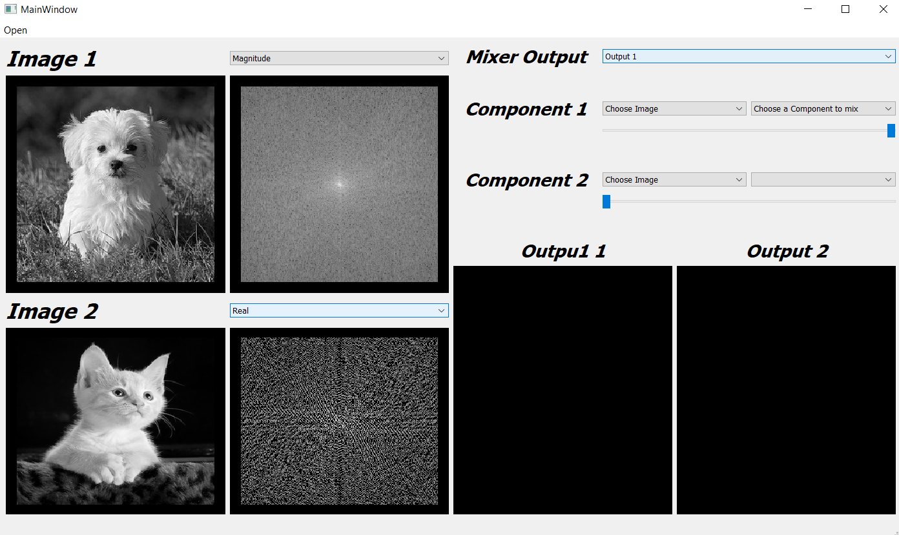
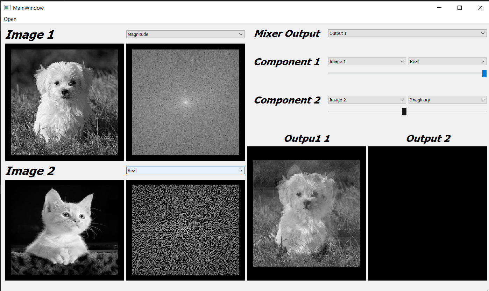
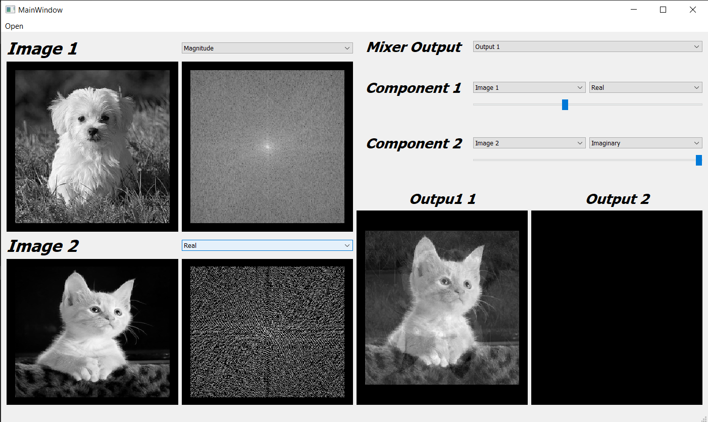
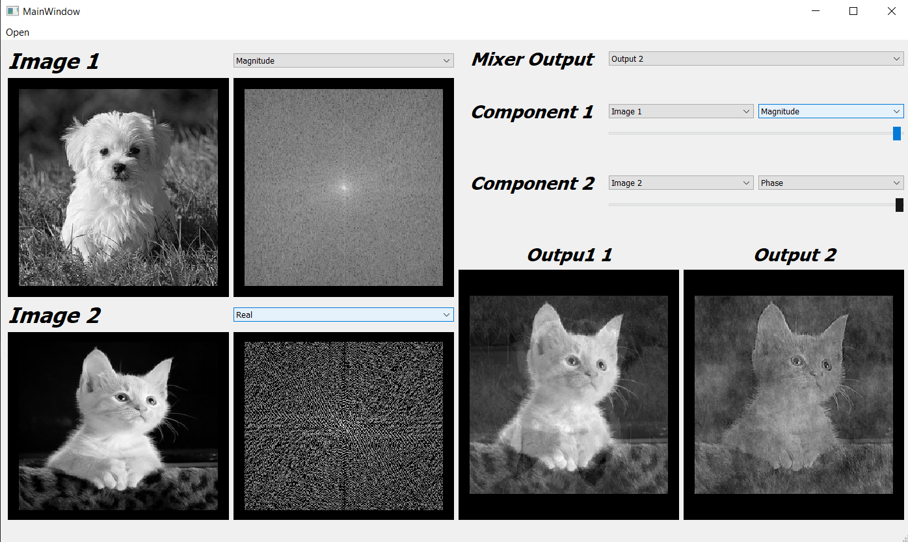

# FFT Image-Mixer (Magnitude&Phase vs Real&Imaginary)
To run this app just first you have to download the included backages, you can do that by writing the following line in your terminal

```terminal
pip install 'backage-name'
```
Then to the app write the following line in the terminal

```terminal
 python starter_file.py
```
<center></center>
<br/>
<center></center>
<br/>
<center></center>
<br/>
<center></center>
<br/>
<center></center>
<br/>
<center></center>
<br/>
<center></center>
<br/>
<center></center>

