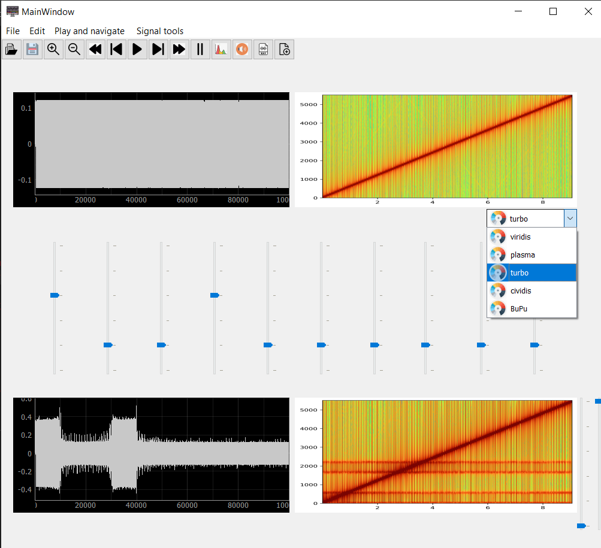

# Digital Signal Processing 
## [App1](https://github.com/Radwa-Saeed/DSP/tree/main/Signal-Viewer) Multi Channel Signal Viewer

## [App2](https://github.com/Radwa-Saeed/DSP/tree/main/Equalizer) Multi Window Sound Equallizer

## [App3](https://github.com/Radwa-Saeed/DSP/tree/main/FFT-ImageMixer) FFT-Image Mixer

## [App4](https://github.com/Radwa-Saeed/DSP/tree/main/Shazam) Sound Recognition "Shazam Replica"

