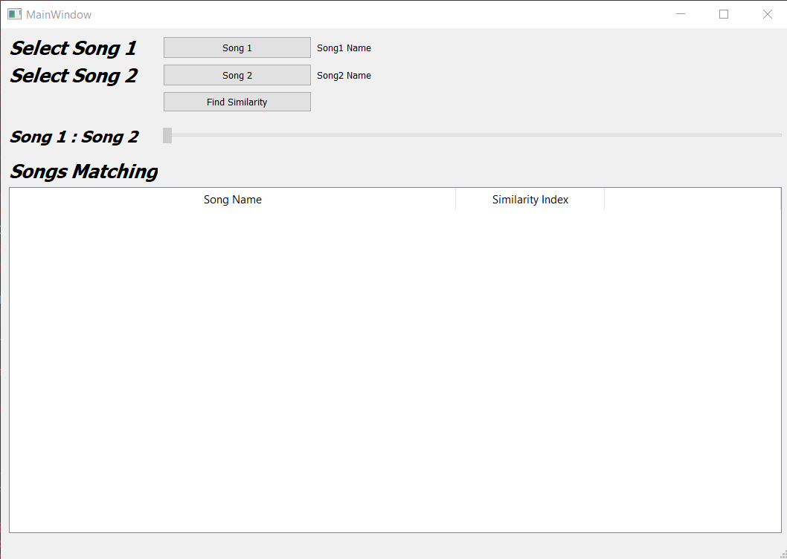
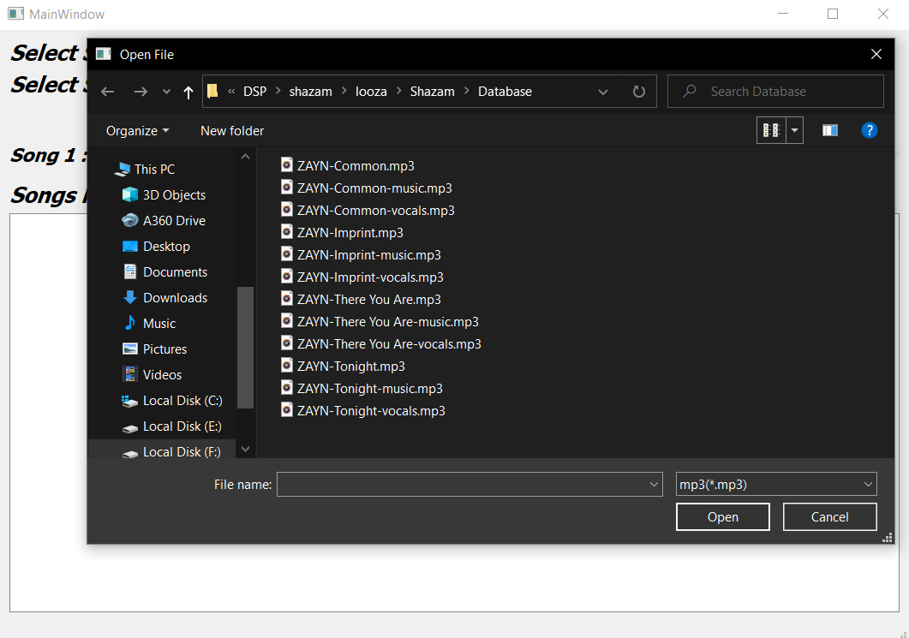
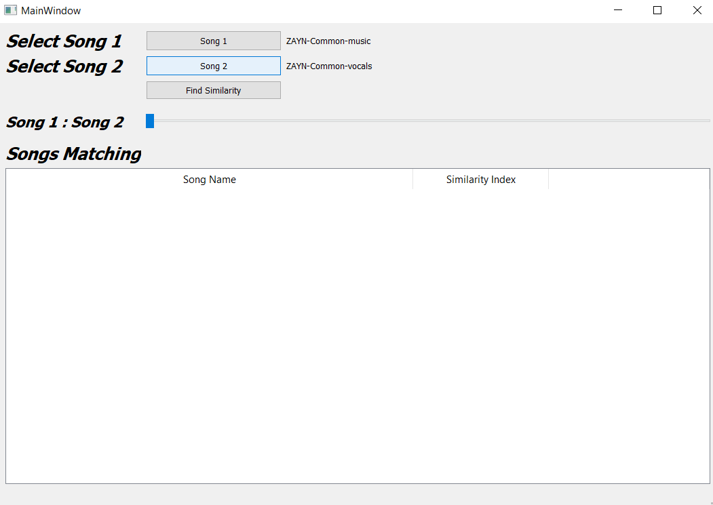
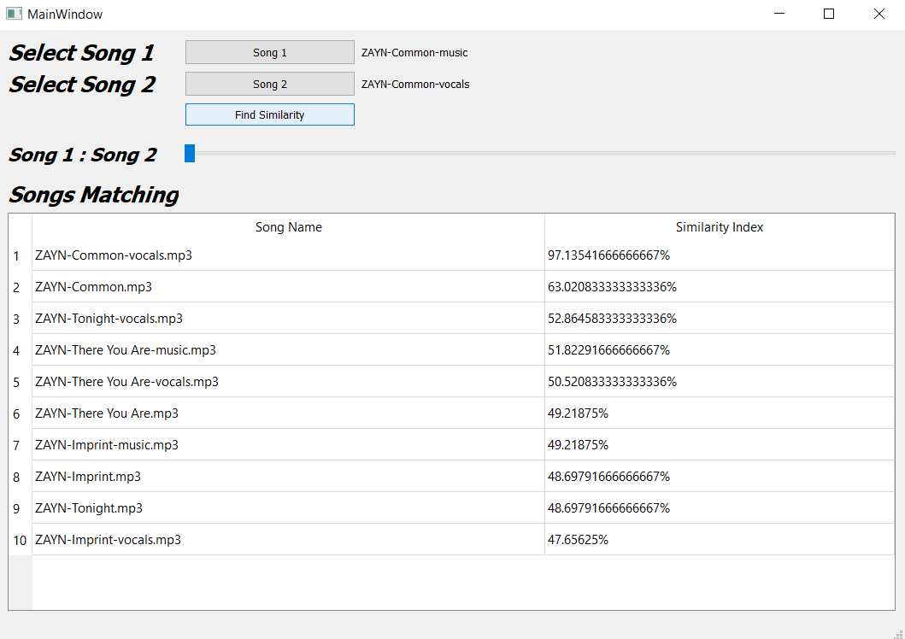
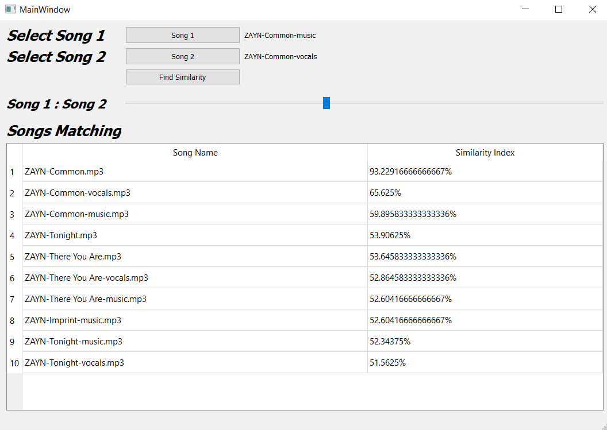
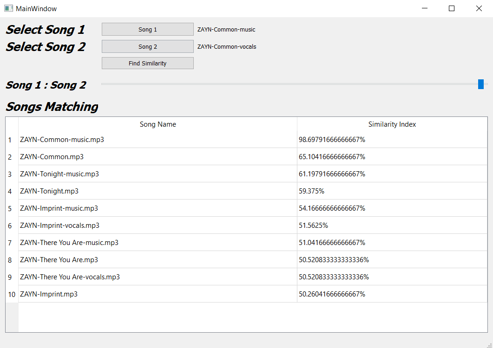

# Shazam like app (Sound Recognision App)
* First we separated sound file into music and vocals then we started to find the most 10 similar sound files saved in database and the desired one (one sound file or two mixed)<br/>
* We compare between tha average of three features extracted from each sound file (melspectrogram, chroma_stft, mfcc) <br/>

<br/>

To run this app just first you have to download the included backages, you can do that by writing the following line in your terminal

```terminal
pip install 'backage-name'
```
Then to the app write the following line in the terminal

```terminal
 python Shazam.py
```
<center></center>
<br/>
<center></center>
<br/>
<center></center>
<br/>
<center></center>
<br/>
<center></center>
<br/>
<center></center>
<br/>
<center></center>
<br/>


