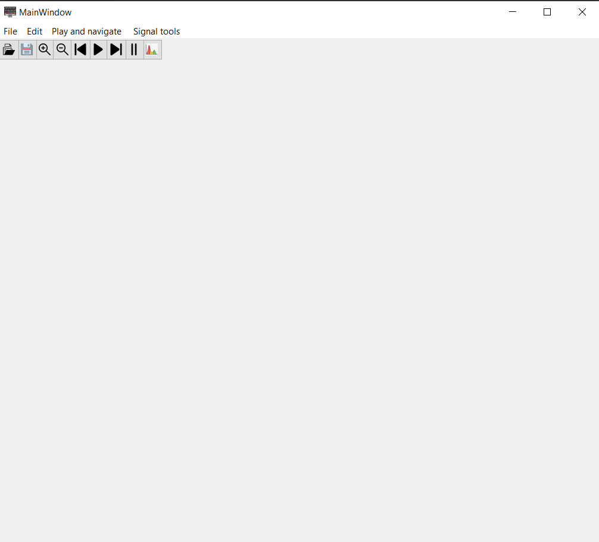
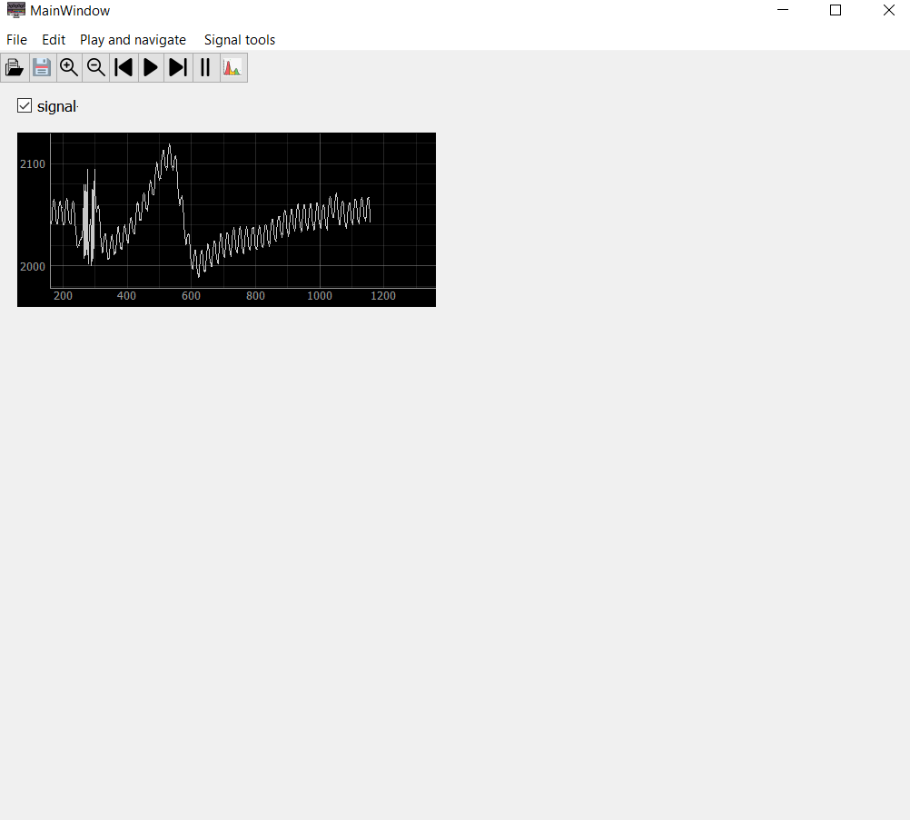
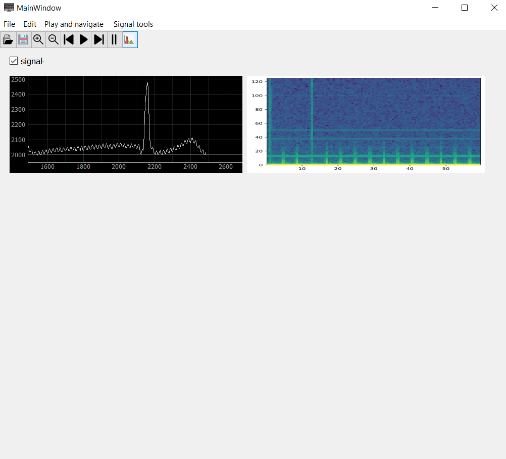
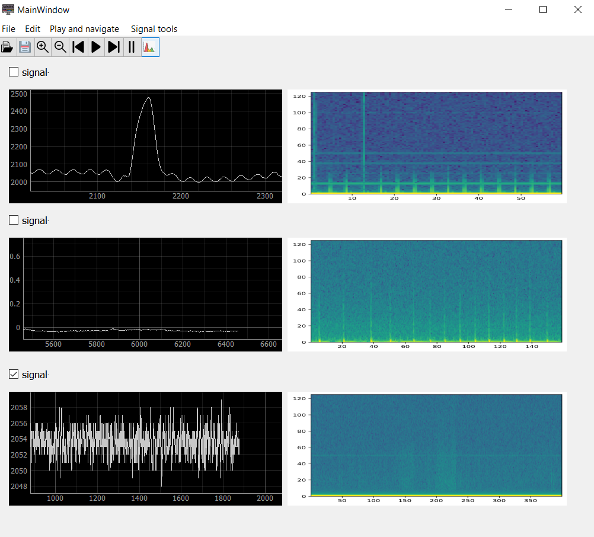
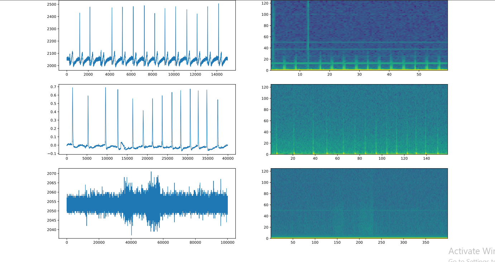

# Multi-Channel Biomedical Signal Viewer App
To run this app just first you have to download the included backages, you can do that by writing the following line in your terminal

```terminal
pip install 'backage-name'
```
Then to the app write the following line in the terminal

```terminal
 python Signal-Viewer.py
```
Here you can see the app default appearance
<center></center>
To open a signal data file press open button or File menu or you can use <kbd>Ctrl</kbd> + <kbd>o</kbd> shortcut, then you will find data samples in data folder </br>
you can select three different data file types ( xls, txt,csv )<br/>
The following fig. shows an example of what will appear
<br/>
<br/>

<center></center>
You can also see the spetrogram of the whole signal by pressing on the spectrogram button or sellecting spectrogram from signal tools menu or using <kbd>s</kbd> shortcut
<br/>
<br/>
<center></center>
We also brovided other features as you can pause, play, scrol-right and left, zoom in and out the signal using button, menu or default shortcuts 
<br/>
in addithon it enables you to visualise another two different signals and appling differnt features on them by selecting the desired signal using the check box
<br/>
<br/>
<center></center>
here you can also save your result as pdf file format as follows using save button
<br/>
<br/>
<center></center>


